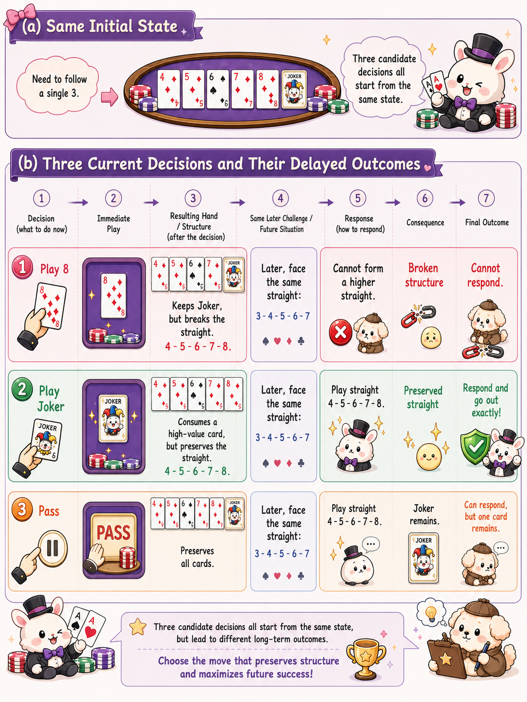

<p align="right">
  <strong>English</strong> | <a href="README.zh-CN.md">简体中文</a>
</p>

<h1 align="center">DanKS</h1>

<p align="center">
  <strong>Three generations of GuanDan AI in one compact, code-first repository</strong>
</p>

<p align="center">
  <a href="#quick-start">Quick start</a> ·
  <a href="#architecture">Architecture</a> ·
  <a href="#generations">Generations</a> ·
  <a href="#train-v3-with-ppo">Training</a> ·
  <a href="https://github.com/Calix-L/CardKS">CardKS paper hub</a>
</p>

<p align="center">
  <a href="https://github.com/Calix-L/DanKS/actions/workflows/ci.yml"></a>
  <a href="https://github.com/Calix-L/DanKS/releases/latest"></a>
  <a href="https://www.python.org/"></a>
  <a href="LICENSE"></a>
</p>

DanKS preserves the evolution of a four-player, partnership-based GuanDan agent: from structural retrieval, through a learned selector, to a memory-aware policy trained with PPO. Each generation is self-contained and uses the same `DanKS` Python namespace, while a shared 108-card rules engine provides the game foundation.

> This repository contains source code only. Model weights, datasets, evaluation records, private documents, credentials, and deployment automation are intentionally excluded.

## Quick start

The shortest runnable path uses V3 on CPU. Commands below assume Python 3.11 and a POSIX shell:

```bash
git clone https://github.com/Calix-L/DanKS.git
cd DanKS
python3.11 -m venv .venv
source .venv/bin/activate
python -m pip install --upgrade pip
python -m pip install -e versions/v3
python -m pip install torch==2.8.0 --index-url https://download.pytorch.org/whl/cpu
python examples/retrieval_quickstart.py --version v3
python examples/v3_model_smoke.py
```

Use `.venv\Scripts\Activate.ps1` on Windows PowerShell. CUDA, Ascend NPU, V1/V2, native-kernel, and development setups are documented in [Installation reference](#installation-reference).

## Architecture


V3 turns a large, structured action space into a compact policy decision:

1. **Encode the information state.** The policy receives the visible hand, public action history, legal actions, and seat-aware game context.
2. **Retrieve structured candidates.** Budgeted decomposition search produces representative plays and summarizes their length, pairs, sequences, suits, gaps, and remaining-hand structure.
3. **Score a bounded Top-K set.** A shared encoder combines state, candidate, and structural features; the actor ranks valid candidates while the critic estimates state value.
4. **Learn from self-play.** Trajectories provide GAE advantages for clipped PPO updates, improving the selector without expanding the inference-time candidate budget.

The diagram shows the complete V3 path. V1 and V2 are earlier, self-contained slices of the same progression: retrieval first, then learned selection, then memory-aware PPO.

## Why DanKS?

- **Three readable generations** — compare complete implementations without mixing their feature or checkpoint contracts.
- **Installable in isolation** — each generation has its own package metadata and dependency contract.
- **End-to-end V3 training** — PPO learner, rollout loading, optimizer state, persistent transport, recall, and team-belief modeling are included.
- **Shared GuanDan engine** — legal moves, table lifecycle, tribute flow, and settlement live in one reusable package.
- **Small public surface** — no duplicated archives, generated manifests, model binaries, or platform-specific evaluation code.

## Generations

| Version | Main idea | What it adds | Entry point |
| --- | --- | --- | --- |
| **V1** | Structural retrieval | Candidate scoring and a NumPy selector | [`ranker.py`](versions/v1/DanKS/retrieval/ranker.py) |
| **V2** | Learned selection | Broader action generation and an ONNX selector | [`action_generator.py`](versions/v2/DanKS/retrieval/action_generator.py) |
| **V3** | Memory-aware policy learning | Card memory, candidate coverage, recall, team belief, and PPO | [`model.py`](versions/v3/DanKS/training/model.py) |

The versions are intentionally isolated. Select one version at a time; their feature schemas and checkpoints are not interchangeable.

## Why delayed outcomes matter

<p align="center">
  
</p>

A move that looks cheap now can destroy the only useful combination left in the hand; spending a powerful card can preserve structure and create a cleaner future exit. DanKS separates the responsibilities needed to learn that distinction:

- **Retrieval** keeps a strategically varied candidate set instead of flattening the full combinatorial action space.
- **Structure features** expose what each candidate consumes, preserves, or leaves behind.
- **The actor** scores the legal candidates available in the current state.
- **The critic and GAE** assign credit from later trajectory outcomes, allowing PPO to favor actions whose value appears several decisions later.

The illustration is a conceptual credit-assignment example. At inference time, V3 scores the retrieved candidates directly; it does not explicitly simulate all three future branches shown in the figure.

## Repository layout

```text
DanKS/
├── assets/             # architecture and decision-making figures
├── versions/
│   ├── v1/DanKS/       # retrieval + NumPy selector
│   ├── v2/DanKS/       # retrieval + ONNX selector
│   └── v3/DanKS/       # retrieval + neural policy + PPO
├── guandan/engine/     # shared Python rules engine
├── examples/           # executable engine, retrieval, and model smoke runs
├── tests/              # repository and engine checks
├── README.zh-CN.md     # complete Simplified Chinese guide
├── pyproject.toml
├── LICENSE
└── NOTICE
```

## Installation reference

The shared engine and V3 support Python 3.10 and newer; V1 and V2 require Python 3.11 or newer. All commands below run from the repository root. Because every generation owns the same `DanKS` import namespace, install **exactly one generation per virtual environment**.

### Choose a package

| Goal | Install command | Notes |
| --- | --- | --- |
| Shared rules engine and tests | `python -m pip install -e '.[dev]'` | No AI generation is installed. |
| V1 · structural retrieval | `python -m pip install -e versions/v1` | NumPy selector; Python 3.11+. |
| V2 · learned selection | `python -m pip install -e versions/v2` | ONNX selector; Python 3.11+. |
| V3 · PPO policy | `python -m pip install -e versions/v3` | Install one PyTorch build below. |

### Select one V3 PyTorch build

| Target | Command |
| --- | --- |
| Linux / Windows CPU | `python -m pip install torch==2.8.0 --index-url https://download.pytorch.org/whl/cpu` |
| NVIDIA CUDA 12.8 | `python -m pip install torch==2.8.0 --index-url https://download.pytorch.org/whl/cu128` |
| macOS CPU | `python -m pip install torch==2.8.0` |

Use the [official PyTorch installation matrix](https://pytorch.org/get-started/previous-versions/) when your platform requires a different wheel. Check the resulting installation with `python examples/v3_model_smoke.py` and inspect all learner options with `python -m DanKS.training.train_ppo --help`.

<details>
<summary><strong>Ascend NPU setup</strong></summary>

The Ascend runtime is coupled to the host driver and CANN installation. Install a matching CANN release first, then use the vendor-provided PyTorch and `torch_npu` wheels. The validated pair is recorded in [`requirements-training-npu.txt`](versions/v3/DanKS/environment/requirements-training-npu.txt).

```bash
source /usr/local/Ascend/cann/set_env.sh
python3.10 -m venv --system-site-packages .venv-v3-npu
source .venv-v3-npu/bin/activate
python -m pip install -e versions/v3
python -m pip install --no-deps \
  /path/to/torch-2.7.1+cpu-cp310-cp310-manylinux_2_28_x86_64.whl \
  /path/to/torch_npu-2.7.1.post2-cp310-cp310-manylinux_2_28_x86_64.whl
export TORCH_DEVICE_BACKEND_AUTOLOAD=0
python -m DanKS.training.train_ppo --help
```

Do not mix CUDA packages into this environment. If the driver, CANN, architecture, or Python version differs, obtain a matching vendor wheel pair rather than forcing the versions above.

</details>

<details>
<summary><strong>Validated configurations</strong></summary>

| Target | System | Python | Framework | Key packages |
| --- | --- | --- | --- | --- |
| CI and shared engine | Linux | 3.10, 3.12 | — | pytest 7+ |
| V1 | CPU | 3.11+ | NumPy selector | NumPy 2.4.6 |
| V2 | CPU | 3.11+ | ONNX selector | NumPy 2.4.6, ONNX Runtime 1.27.0 |
| V3 NVIDIA server | H100, driver 575.57.08 | 3.11.14 | PyTorch 2.8.0 + CUDA 12.8 | NumPy 2.4.6, pybind11 3.0.4 |
| V3 Ascend server | Ubuntu 22.04.5, 910B2C, driver 24.1.0, CANN 8.5.0 | 3.10.12 | PyTorch 2.7.1 + torch_npu 2.7.1.post2 | NumPy 1.26.0, pybind11 3.0.4 |

These are reproducibility references, not minimum hardware requirements.

</details>

### Optional V3 C++ acceleration

The optimized retrieval kernels currently support Linux and macOS. They require a C++17 compiler, Python development headers, and `pybind11`; Windows uses the Python fallback. Install the platform toolchain once:

```bash
# Ubuntu/Debian
sudo apt-get update && sudo apt-get install -y build-essential python3-dev

# macOS (run once)
xcode-select --install
```

Then build and verify both kernels with one command in the active V3 environment:

```bash
danks-build-native
```

The command locates the installed V3 source tree automatically and finishes with `cover=True, actor=True`. Linux builds use host-specific compiler optimization; macOS leaves architecture selection to its Python toolchain so universal2 builds remain valid. Run it again after changing Python versions or CPU architecture. Windows continues to use the Python fallback.

### Development checks

```bash
python -m pip install -e '.[dev]'
python -m pytest -q
```

## Run the examples

The examples are deliberately small and require no pretrained weights or private data:

```bash
# Shared rules engine; available from the base environment.
python examples/engine_quickstart.py

# Structural retrieval; run inside a matching V1, V2, or V3 environment.
python examples/retrieval_quickstart.py --version v3

# Full V3 network forward pass; run inside a V3 environment with PyTorch.
python examples/v3_model_smoke.py

# One synthetic optimizer update through the V3 PPO learner.
python examples/v3_ppo_smoke.py
```

Each command performs internal assertions and exits non-zero if its contract is broken.

## Shared game engine

The engine can be used independently of the AI generations:

```python
from guandan import Environment

game = Environment(first_player=0)
for seat in range(4):
    game.add_player(f"player-{seat}", seat)

messages = game.start()
assert all(len(player.hand_cards) == 27 for player in game.players)
```

The public API also exports `Move` and `Moves` for move representation and legal-action generation.

## Train V3 with PPO

After activating and verifying a V3 environment, provide your own rollout and output paths:

```bash
python -m DanKS.training.train_ppo \
  --rollout /path/to/rollout.npz \
  --output /path/to/checkpoint.pt \
  --device auto
```

The learner expects rollout arrays for state, candidates, masks, history, actions, behavior log-probabilities, advantages, and returns. Run the entry point with `--help` for optimization, evaluation, accelerator, and initialization options.

The V3 training implementation lives in [`versions/v3/DanKS/training`](versions/v3/DanKS/training) and includes:

- model and feature definitions;
- PPO objectives and tactical resampling;
- checkpoint and optimizer-state handling;
- persistent learner transport;
- recall and team-belief auxiliary paths;
- CPU, CUDA, and NPU-aware accelerator helpers.

## Project boundaries

DanKS does not distribute pretrained checkpoints or the data needed to reproduce private training runs. Bring your own rollout data and keep generated checkpoints outside the repository. The source tree is designed for code inspection, adaptation, and independent experimentation.

## Contributing

Focused bug fixes, tests, portability improvements, and clearly scoped algorithm changes are welcome. Read the [contribution guide](.github/CONTRIBUTING.md) before opening a pull request.

## License

DanKS is available under the [Apache License 2.0](LICENSE). Third-party dependencies retain their respective licenses; see [NOTICE](NOTICE).
