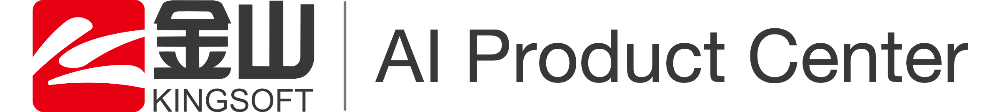
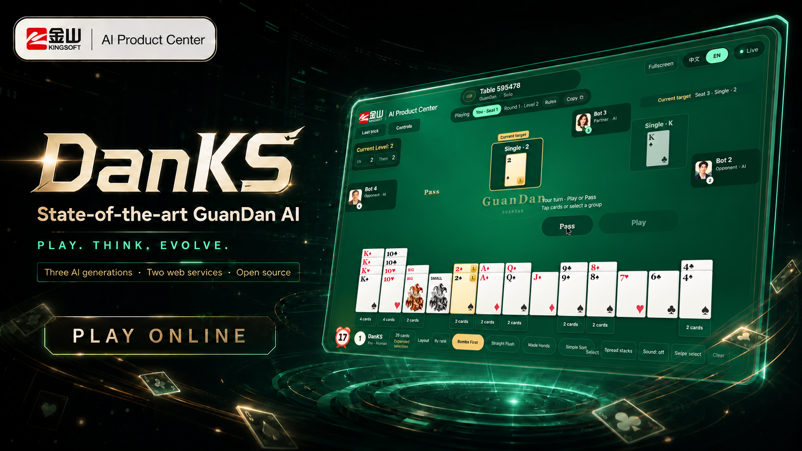
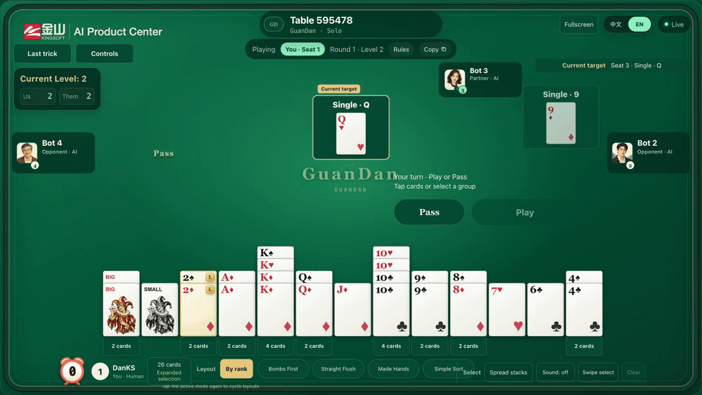
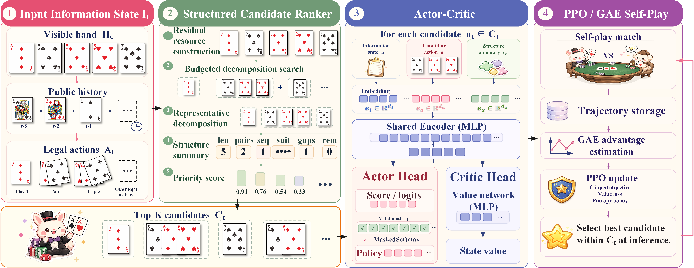
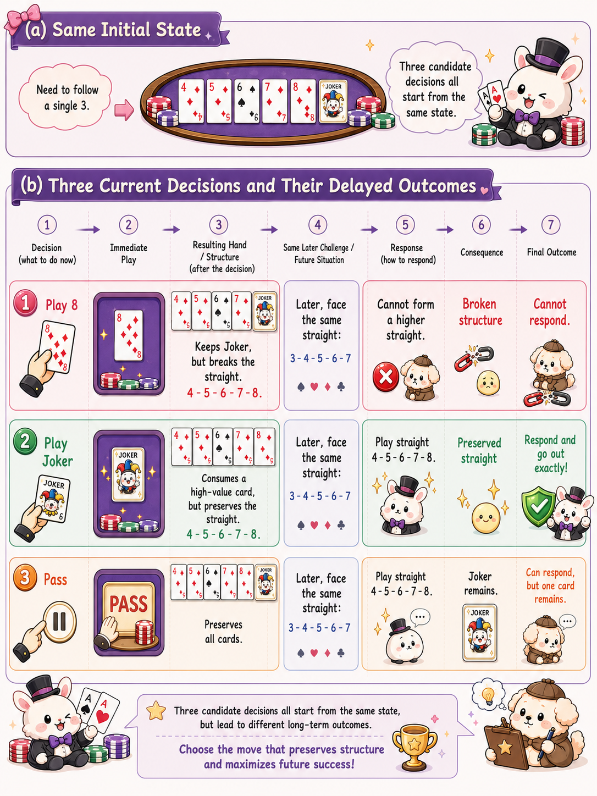

<p align="right">
  <strong>English</strong> | <a href="README.zh-CN.md">简体中文</a>
</p>

<p align="center">
  <a href="https://www.kingsoft.com/">
    
  </a>
</p>

<h1 align="center">DanKS: State-of-the-art GuanDan AI</h1>

<p align="center">
  <strong>Three complete generations of code</strong><br>
  PPO learning · V3Pro decision refinement · Two generations of KSPlay GuanDan Service
</p>

<p align="center">
  <a href="https://github.com/Calix-L/DanKS/actions/workflows/ci.yml"></a>
  <a href="https://github.com/Calix-L/DanKS/stargazers"></a>
  <a href="LICENSE"></a>
</p>

<p align="center">
  <a href="https://calixlin.com/CardKS/"><strong>Play online ↗</strong></a> ·
  <a href="#how-danks-thinks">Architecture</a> ·
  <a href="#ksplay-guandan-service">Web services</a> ·
  <a href="#human-guandan-data">Dataset</a> ·
  <a href="#get-started">Get started</a> ·
  <a href="https://github.com/Calix-L/CardKS">Research</a>
</p>

<p align="center"><strong>Not just a stronger move. A better plan for the rest of the hand.</strong></p>

GuanDan is a game of partnership, hidden information, and long-term control. The cheapest card to play now may break your best combination; a pass may give your teammate the lead.

**DanKS learns to choose with the rest of the hand in mind.** Developed by the **Kingsoft AI Product Center**, it brings structure-aware retrieval and PPO policy learning together—and now pairs the AI codebase with two generations of an open-source web game service. Study the agent, train a policy, build your own table, or simply sit down and play.

<p align="center">
  <a href="https://calixlin.com/CardKS/">
    
  </a>
</p>

## Online demo

**Take your seat. Challenge DanKS. No installation required.**

[Open the online table →](https://calixlin.com/CardKS/)

One human player, one AI teammate, and two AI opponents. Play through your browser with a Chinese or English interface.

<p align="center"><strong>Watch a short gameplay preview</strong></p>

<p align="center">
  <a href="https://calixlin.com/CardKS/">
    
  </a><br>
  <sub><a href="assets/danks-online-demo.png">Full-size table preview</a> · <a href="assets/danks-social-preview.png">Social preview</a></sub>
</p>

## How DanKS thinks

**Preserve useful options. Learn when to use them.**



1. **Understand the position.** Encode the visible hand, public history, legal actions, and team context.
2. **Look beyond the current play.** Apply candidate actions and examine the combinations left in the residual hand.
3. **Choose from a compact, meaningful set.** Rank structured candidates with a state- and candidate-conditioned Actor-Critic.
4. **Learn from what happens next.** PPO and GAE connect a decision to its later consequences.

Retrieval identifies useful options; the learned policy decides which option fits the moment.

<p align="center">
  <a href="assets/structure-aware-delayed-outcomes.png">
    
  </a><br>
  <sub>Same hand. Three choices. Different futures. Click to explore the decision example.</sub>
</p>

## Three generations. One evolving idea.

| AI generation | Focus | Explore |
| --- | --- | --- |
| **V1** | Structural retrieval and a NumPy candidate selector | [Retrieval ranker](versions/v1/DanKS/retrieval/ranker.py) |
| **V2** | Expanded candidate generation and an ONNX selector | [Action generator](versions/v2/DanKS/retrieval/action_generator.py) |
| **V3** | Memory-aware neural selection, team-belief features, and PPO learning | [Policy network](versions/v3/DanKS/training/model.py) · [PPO training](versions/v3/DanKS/training) |
| **V3Pro** | V3 inference refinement: asset protection, equivalent-play rules, and verified endgame search | [Policy](versions/v3pro/DanKSPro/policy.py) · [Integration guide](versions/v3pro/USAGE.md) |

V3Pro extends V3 as the separate `DanKSPro` package. It refines inference without replacing the network or retraining it. Endgame refinement covers admitted positions with at most 16 remaining cards across the table; for 11–16 cards, hidden-card allocations are additionally capped at 128.

## KSPlay GuanDan Service

**The AI is only half the experience. Now the table is open source, too.**

Both Service generations include the browser frontend, room backend, GuanDan referee, full source-built hand arrangement, and a standard external AI interface.

- **Service V1 — the original table.** A compact starting point with the classic CardKS experience.
- **Service V2 — the redesigned table.** A fixed-aspect desktop and mobile-landscape layout, modular interactions, and improved session recovery.

[Explore Service V1 →](services/v1/README.md) · [Explore Service V2 →](services/v2/README.md)

The service versions describe the **web platform**, independently of the AI generations. Both run locally with example rule-based bots; connect your own model through the [HTTP AI interface](services/v2/docs/AI_INTERFACE.md). Trained weights and private AI serving infrastructure are not included.

### Build on it

| Your idea | Start here |
| --- | --- |
| Redesign the table or card interactions | [V2 frontend](services/v2/web) |
| Extend rooms, game flow, or realtime updates | [V2 backend](services/v2/backend) |
| Customize hand arrangement | [Go arranger](services/v2/arranger) |
| Connect a new AI | [AI request/response contract](services/v2/docs/AI_INTERFACE.md) |
| Find the right module to change | [Service development guide](services/v2/docs/DEVELOPMENT.md) |

## Human GuanDan data

**Study complete matches, not just isolated moves.**

The public [KSCB GuanDan dataset](https://github.com/Calix-L/CardKS/blob/main/KSCB/data/guandan_matches.jsonl.gz), maintained in CardKS, contains **899 complete promotion matches**, **10,218 rounds**, and **840,194 decision points**. Ordered round events make it useful for studying human decisions, partnership play, and hand structure over time.

[Explore the data →](datasets/README.md) · [Source format →](https://github.com/Calix-L/CardKS/blob/main/KSCB/README.md)

The `datasets/` directory links to the original release and provides download and reading examples. Data stays in CardKS; DanKS does not duplicate it. These are match records, not precomputed PPO inputs.

## Get started

### Play your own local table

Use **Python 3.12 and Go 1.23+**. From a POSIX shell:

```bash
git clone https://github.com/Calix-L/DanKS.git
cd DanKS/services/v2
python3.12 -m venv .venv
source .venv/bin/activate
python -m pip install -r requirements.txt
python scripts/build_arranger.py
python run.py
```

Open **http://127.0.0.1:8000/solo**, create a table, and click Ready. Three example bots fill the other seats. Ctrl+C stops the service.

On Windows PowerShell, create the environment with `py -3.12 -m venv .venv` and activate it with `.venv\Scripts\Activate.ps1`. To use the original table, choose `services/v1` instead.

### Explore the AI

In a separate **Python 3.11+** environment, run from the repository root:

```bash
python3.11 -m venv .venv-ai
source .venv-ai/bin/activate
python -m pip install -e . -e versions/v3 -e versions/v3pro
python -m pip install torch==2.8.0
python examples/retrieval_quickstart.py --version v3
python examples/v3_model_smoke.py
python examples/v3pro_smoke.py
```

The examples exercise retrieval, network inference, and V3Pro integration using synthetic inputs; model smoke runs use random initialization. For CPU/CUDA/NPU setup, V1/V2 installation, and PPO learner commands, follow the [developer guide](.github/guides/DEVELOPMENT.md). For optional Linux/macOS C++ retrieval acceleration, run `danks-build-native` in your V3 environment.

## Inside the repository

```text
DanKS/
├── versions/           # AI: V1, V2, V3, and the V3Pro extension
├── services/
│   ├── v1/             # KSPlay GuanDan Service · original table
│   └── v2/             # KSPlay GuanDan Service · redesigned table
├── guandan/engine/     # Shared AI-side GuanDan rules engine
├── examples/           # Executable engine, retrieval, model, and PPO examples
├── datasets/           # Public GuanDan data links and reading guide
├── assets/             # Brand, gameplay preview, and architecture illustrations
└── .github/            # Contribution and developer guides, CI
```

Each Service is independently runnable and keeps its own rules and hand-arrangement modules. The AI generations remain separate packages; use a dedicated environment for each generation.

## Join the project

Build a new agent. Create a better table. Explore a new idea in partnership play.

Contributions to algorithms, UI, portability, and documentation are welcome. Start with the [contribution guide](.github/CONTRIBUTING.md) or [open an issue](https://github.com/Calix-L/DanKS/issues).

**Repositories:** [GitHub](https://github.com/Calix-L/DanKS) · [AtomGit mirror](https://atomgit.com/Calix_Lin/DanKS)<br>
**Research:** [CardKS](https://github.com/Calix-L/CardKS)<br>
**License:** [Apache-2.0](LICENSE) · [Notices](NOTICE)

### Star history

<p align="center">
  <a href="https://www.star-history.com/#Calix-L/DanKS&Date">
    <picture>
      <source media="(prefers-color-scheme: dark)" srcset="https://api.star-history.com/svg?repos=Calix-L/DanKS&type=Date&theme=dark">
      
    </picture>
  </a>
</p>
