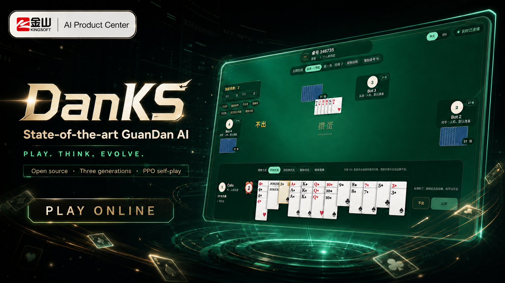
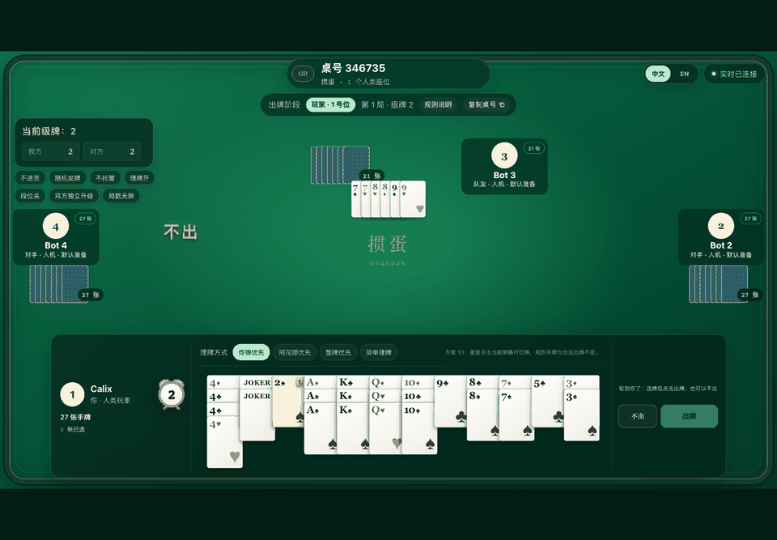
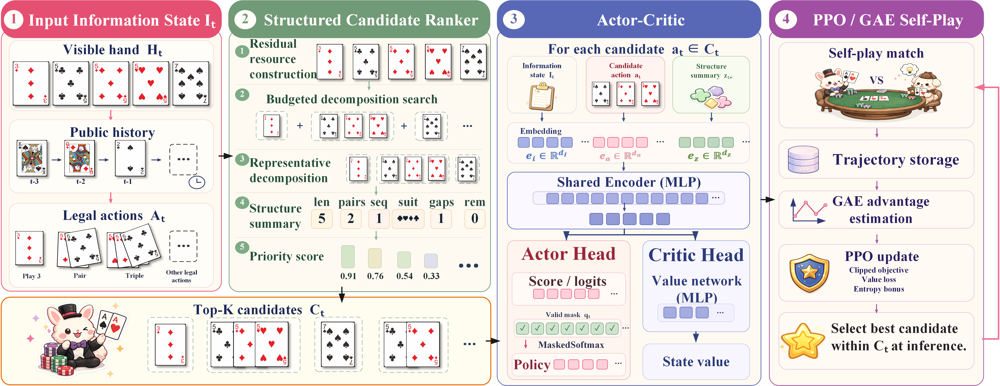

<p align="right">
  <a href="README.md">English</a> | <strong>简体中文</strong>
</p>

<p align="center">
  👋 大家好！DanKS 是由 <strong>Kingsoft AI Product Center</strong> 发起的掼蛋 AI 项目。
</p>

<p align="center">
  <a href="https://github.com/Calix-L/DanKS/actions/workflows/ci.yml"></a>
  <a href="https://github.com/Calix-L/DanKS/releases/latest"></a>
  <a href="https://www.python.org/"></a>
  <a href="LICENSE"></a>
</p>

<p align="center">
  <a href="https://www.kingsoft.com/">
    
  </a>
</p>

<h1 align="center">DanKS：SOTA 级掼蛋智能体</h1>

<p align="center">
  <strong>完整开放三代技术路线</strong>
</p>

<p align="center">
  <a href="https://calixlin.com/CardKS/">在线体验</a> ·
  <a href="#快速开始">快速开始</a> ·
  <a href="#总体架构">总体架构</a> ·
  <a href="#三代技术路线">三代路线</a> ·
  <a href="#使用-ppo-训练-v3">训练</a> ·
  <a href="https://github.com/Calix-L/CardKS">CardKS 论文</a>
</p>

这就是 DanKS——为攻克四人组队掼蛋而生的 SOTA 级智能体。一个仓库完整揭秘三代技术跃迁：从结构化召回、学习型候选选择，到基于 PPO 训练的记忆感知策略——全程由共享的 108 张牌掼蛋规则引擎驱动。

## 在线体验

<p align="center">
  <a href="https://calixlin.com/CardKS/">
    
  </a>
</p>

<p align="center">
  <a href="https://calixlin.com/CardKS/"><strong>▶ 在浏览器中挑战 DanKS</strong></a>
  <br />
  <sub>无需本地安装 · 1 个人类座位与 3 个 Bot 座位 · 支持中英文界面</sub>
</p>

<details>
  <summary>查看简短对局预览</summary>
  <p align="center">
    <a href="https://calixlin.com/CardKS/">
      
    </a>
    <br />
    <sub>
      <a href="assets/danks-online-demo.png">查看高清真实牌桌</a> ·
      <a href="assets/danks-social-preview.png">下载 1280 × 640 社交分享图</a>
    </sub>
  </p>
</details>

## 快速开始

最短的可运行路径是在 CPU 上使用 V3。以下命令以 Python 3.11 和 POSIX shell 为例：

```bash
git clone https://github.com/Calix-L/DanKS.git
cd DanKS
python3.11 -m venv .venv
source .venv/bin/activate
python -m pip install --upgrade pip
python -m pip install -e versions/v3
python -m pip install torch==2.8.0 --index-url https://download.pytorch.org/whl/cpu
python examples/retrieval_quickstart.py --version v3
python examples/v3_model_smoke.py
```

Windows PowerShell 请使用 `.venv\Scripts\Activate.ps1`。CUDA、昇腾 NPU、V1/V2、原生内核与开发环境请参阅[安装参考](#安装参考)。

## 总体架构



DanKS 将庞大且高度结构化的动作空间，压缩成一次边界清晰的策略决策：

1. **编码信息状态。** 策略网络接收可见手牌、公开出牌历史、合法动作和座位相关的对局上下文。
2. **检索结构化候选。** 有预算的拆牌搜索生成具有代表性的出牌方案，并概括牌数、对子、序列、花色、缺口以及剩余手牌结构。
3. **评分有界的 Top-K 候选集。** 共享编码器融合状态、候选动作和结构特征；Actor 对有效候选排序，Critic 估计当前状态价值。
4. **从自对弈中学习。** 轨迹数据为裁剪 PPO 更新提供 GAE 优势估计，在不增加推理阶段候选预算的前提下改进选择器。

这张总体架构图贯穿 DanKS 的三代技术路线，完整呈现信息状态、结构化候选召回、策略与价值估计以及自博弈优化。各版本在这一共同框架上持续升级特征、召回方式和策略实现，主要演进见下表。

## 为什么选择 DanKS？

- **SOTA 级实战实力** —— 在完整掼蛋晋级赛协议下，DanKS 面对多种强学习型和规则型基线均取得领先结果，详见 [CardKS 主要实验](https://github.com/Calix-L/CardKS#main-results)。
- **三代代码清晰可读** —— V1、V2、V3 完整呈现技术演进过程，关键算法变化可以逐代阅读、运行和比较。
- **全链路实现完整** —— 仓库覆盖掼蛋规则引擎、合法动作生成、结构化召回、状态与候选特征、策略与价值网络、PPO 训练、checkpoint 管理、原生加速和可运行的推理示例。

## 三代技术路线

| 版本 | 核心思路 | 主要增量 | 入口 |
| --- | --- | --- | --- |
| **V1** | 结构化检索 | 候选评分和 NumPy 选择器 | [`ranker.py`](versions/v1/DanKS/retrieval/ranker.py) |
| **V2** | 学习型选择 | 更广的动作生成和 ONNX 选择器 | [`action_generator.py`](versions/v2/DanKS/retrieval/action_generator.py) |
| **V3** | 记忆感知策略学习 | 记牌、候选覆盖、召回、队伍信念和 PPO | [`model.py`](versions/v3/DanKS/training/model.py) |

V1、V2、V3 分别提供独立安装包。为每个版本创建独立环境，即可让 `DanKS` 导入名、特征定义和 checkpoint 格式始终保持一致。

## 为什么要关注延迟结果？

<p align="center">
  
</p>

一个当下代价很低的动作，可能破坏手中唯一有用的组合；而主动消耗一张高价值牌，反而可能保留整体牌型结构，并带来更干净的后续出完路径。DanKS 将学习这种差异所需的职责进行了拆分：

- **Retrieval** 将组合动作空间组织为具有策略多样性的候选集。
- **结构特征** 显式表达每个候选会消耗什么、保留什么，以及出牌后留下什么。
- **Actor** 为当前状态下的合法候选动作评分。
- **Critic 和 GAE** 从后续轨迹结果中分配信用，使 PPO 能够偏好价值需要数次决策后才体现的动作。

上图展示了长程信用分配的核心直觉：V3 直接评估检索得到的候选动作，并通过后续轨迹学习每个选择的长期价值。

## 仓库结构

```text
DanKS/
├── assets/             # 品牌标识、在线 Demo、架构图与决策示意图
├── versions/
│   ├── v1/DanKS/       # 结构化检索 + NumPy 选择器
│   ├── v2/DanKS/       # 结构化检索 + ONNX 选择器
│   └── v3/DanKS/       # 结构化检索 + 神经策略 + PPO
├── guandan/engine/     # 共享 Python 规则引擎
├── examples/           # 可执行的引擎、检索和模型冒烟示例
├── tests/              # 仓库与引擎检查
├── README.zh-CN.md     # 完整的简体中文指南
├── pyproject.toml
├── LICENSE
└── NOTICE
```

## 安装参考

共享引擎和 V3 支持 Python 3.10 及更高版本；V1 和 V2 支持 Python 3.11 及更高版本。以下命令均从仓库根目录运行。推荐为每个版本创建独立虚拟环境，使 `DanKS` 命名空间与对应的特征、模型格式自然对齐。

### 选择安装包

| 目标 | 安装命令 | 说明 |
| --- | --- | --- |
| 共享规则引擎与测试 | `python -m pip install -e '.[dev]'` | 规则引擎与仓库测试套件。 |
| V1 · 结构化检索 | `python -m pip install -e versions/v1` | NumPy 选择器；Python 3.11+。 |
| V2 · 学习型选择 | `python -m pip install -e versions/v2` | ONNX 选择器；Python 3.11+。 |
| V3 · PPO 策略 | `python -m pip install -e versions/v3` | 还需安装下方一种 PyTorch 构建。 |

### 为 V3 选择一种 PyTorch 构建

| 目标 | 命令 |
| --- | --- |
| Linux / Windows CPU | `python -m pip install torch==2.8.0 --index-url https://download.pytorch.org/whl/cpu` |
| NVIDIA CUDA 12.8 | `python -m pip install torch==2.8.0 --index-url https://download.pytorch.org/whl/cu128` |
| macOS CPU | `python -m pip install torch==2.8.0` |

如果平台需要不同 wheel，请参考 [PyTorch 官方安装矩阵](https://pytorch.org/get-started/previous-versions/)。使用 `python examples/v3_model_smoke.py` 检查安装，使用 `python -m DanKS.training.train_ppo --help` 查看 learner 的全部参数。

<details>
<summary><strong>昇腾 NPU 环境</strong></summary>

昇腾运行时与主机驱动及 CANN 版本配套使用。安装匹配的 CANN 后，再安装厂商提供的 PyTorch 与 `torch_npu` wheel。已验证组合记录在 [`requirements-training-npu.txt`](versions/v3/DanKS/environment/requirements-training-npu.txt)。

```bash
source /usr/local/Ascend/cann/set_env.sh
python3.10 -m venv --system-site-packages .venv-v3-npu
source .venv-v3-npu/bin/activate
python -m pip install -e versions/v3
python -m pip install --no-deps \
  /path/to/torch-2.7.1+cpu-cp310-cp310-manylinux_2_28_x86_64.whl \
  /path/to/torch_npu-2.7.1.post2-cp310-cp310-manylinux_2_28_x86_64.whl
export TORCH_DEVICE_BACKEND_AUTOLOAD=0
python -m DanKS.training.train_ppo --help
```

建议将该虚拟环境专用于昇腾 NPU。其他驱动、CANN、处理器架构或 Python 版本可选用对应的厂商 wheel。

</details>

<details>
<summary><strong>已验证配置</strong></summary>

| 目标 | 系统 | Python | 框架 | 关键软件包 |
| --- | --- | --- | --- | --- |
| CI 与共享引擎 | Linux | 3.10, 3.12 | — | pytest 7+ |
| V1 | CPU | 3.11+ | NumPy 选择器 | NumPy 2.4.6 |
| V2 | CPU | 3.11+ | ONNX 选择器 | NumPy 2.4.6, ONNX Runtime 1.27.0 |
| V3 NVIDIA 服务器 | H100, driver 575.57.08 | 3.11.14 | PyTorch 2.8.0 + CUDA 12.8 | NumPy 2.4.6, pybind11 3.0.4 |
| V3 昇腾服务器 | Ubuntu 22.04.5, 910B2C, driver 24.1.0, CANN 8.5.0 | 3.10.12 | PyTorch 2.7.1 + torch_npu 2.7.1.post2 | NumPy 1.26.0, pybind11 3.0.4 |

这些是经过验证的参考配置，其他兼容环境也可以运行 DanKS。

</details>

### 可选的 V3 C++ 加速

优化后的检索内核支持 Linux 和 macOS，需要 C++17 编译器、Python 开发头文件和 `pybind11`；Windows 自动使用 Python 实现。首先安装平台工具链：

```bash
# Ubuntu/Debian
sudo apt-get update && sudo apt-get install -y build-essential python3-dev

# macOS（仅需执行一次）
xcode-select --install
```

然后在已激活的 V3 环境中，用一条命令完成两个内核的构建与验证：

```bash
danks-build-native
```

该命令会自动定位已安装的 V3 源码，成功后输出 `cover=True, actor=True`。Linux 构建启用主机编译优化；macOS 由 Python 工具链选择架构并支持 universal2 构建。更换 Python 版本或 CPU 架构后重新运行即可。Windows 会自动选择 Python 实现。

### 开发检查

```bash
python -m pip install -e '.[dev]'
python -m pytest -q
```

## 运行示例

示例覆盖规则引擎、结构化检索、完整网络前向传播和 PPO 更新，可直接从源码运行：

```bash
# 共享规则引擎；可在基础环境中运行。
python examples/engine_quickstart.py

# 结构化检索；请在匹配的 V1、V2 或 V3 环境中运行。
python examples/retrieval_quickstart.py --version v3

# 完整 V3 网络前向传播；请在已安装 PyTorch 的 V3 环境中运行。
python examples/v3_model_smoke.py

# 通过 V3 PPO learner 执行一次合成优化器更新。
python examples/v3_ppo_smoke.py
```

每条命令都包含自检断言，便于快速确认当前环境和代码路径运行正常。

## 共享游戏引擎

规则引擎可以独立于三代 AI 使用：

```python
from guandan import Environment

game = Environment(first_player=0)
for seat in range(4):
    game.add_player(f"player-{seat}", seat)

messages = game.start()
assert all(len(player.hand_cards) == 27 for player in game.players)
```

公开 API 还导出了 `Move` 和 `Moves`，用于表示出牌动作与生成合法动作。

## 使用 PPO 训练 V3

激活并验证 V3 环境后，指定 rollout 与 checkpoint 输出路径：

```bash
python -m DanKS.training.train_ppo \
  --rollout /path/to/rollout.npz \
  --output /path/to/checkpoint.pt \
  --device auto
```

Learner 期望 rollout 中包含状态、候选动作、mask、历史、动作、行为策略对数概率、优势和回报数组。使用 `--help` 查看优化、评估、加速器和初始化选项。

V3 训练实现位于 [`versions/v3/DanKS/training`](versions/v3/DanKS/training)，包含：

- 模型与特征定义；
- PPO 目标与战术重采样；
- checkpoint 与优化器状态处理；
- 持久化 learner 传输；
- 召回和队伍信念辅助路径；
- 感知 CPU、CUDA 和 NPU 的加速器辅助工具。

## 参与贡献

欢迎提交缺陷修复、测试、可移植性改进与算法创新。参与方式见[贡献指南](.github/CONTRIBUTING.md)。

## 开源许可

DanKS 基于 [Apache License 2.0](LICENSE) 开源。第三方依赖仍适用各自的许可证；详见 [NOTICE](NOTICE)。
